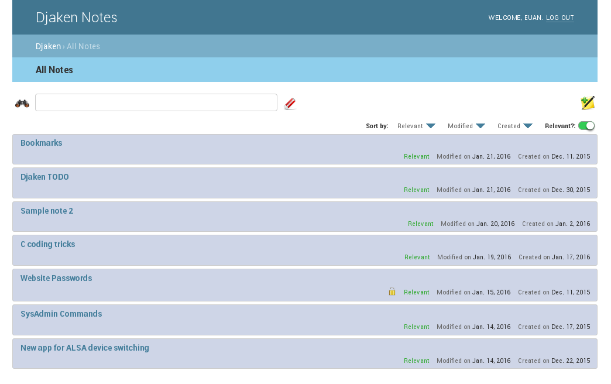
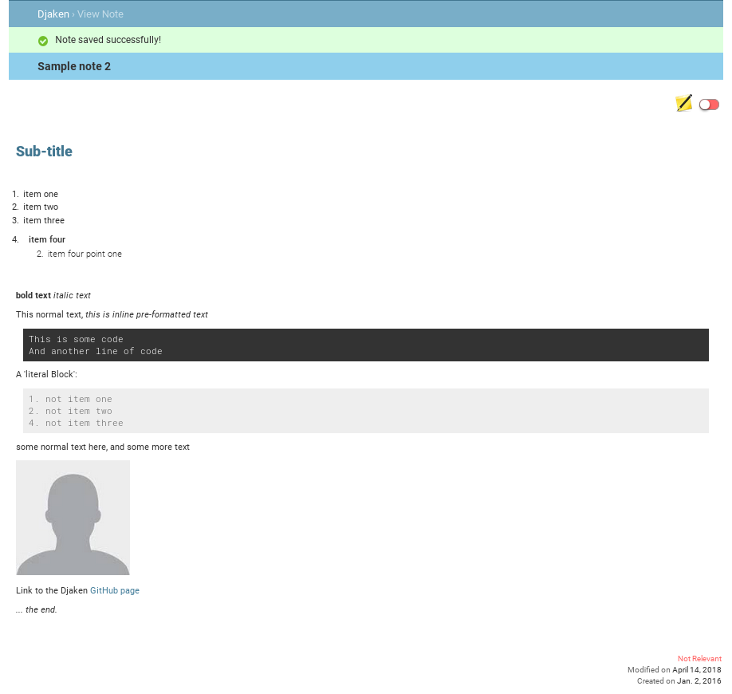
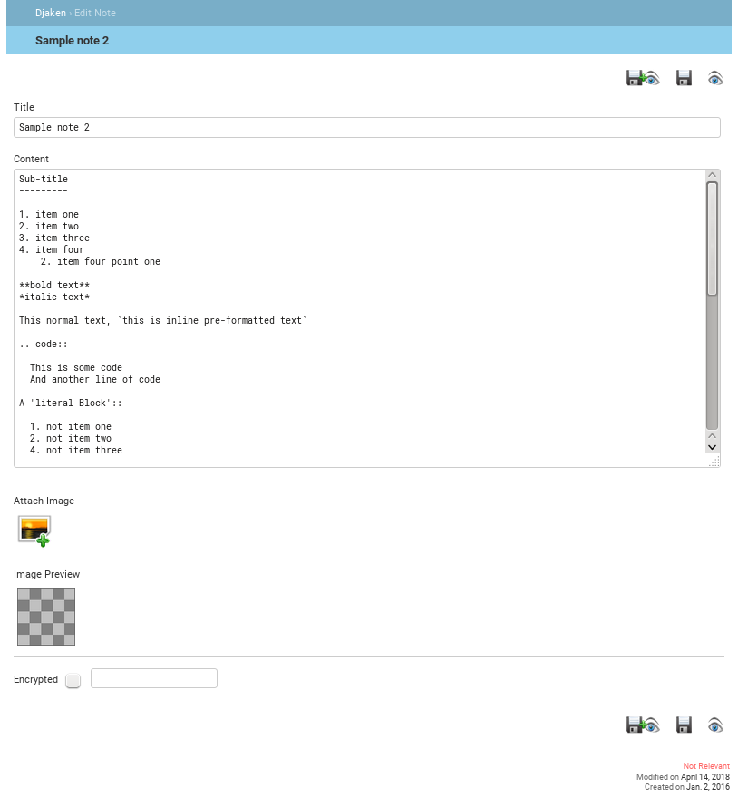
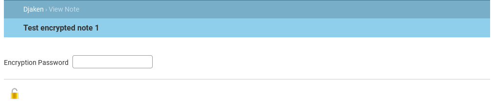

Djaken Notes
============

Djaken is a complete web-based notes application for Django.

News
----

Version 2.0rc1 released! (2018/12/06)
^^^^^^^^^^^^^^^^^^^^^^^^^^^^^^^^^^^^

Version 2.0b1 released! (2018/04/14)
^^^^^^^^^^^^^^^^^^^^^^^^^^^^^^^^^^^^

**Changes in 2.0~:**

- Replace Markdown with reStructuredText.
- Move inline images to seperate model (DB) field, 
  thus avoiding search and markup processing on bulky image data. 
  It also takes away the encoded image data from the markup text.
- GUI: several improvements (HTML templates and CSS).
- GUI: Edit Note; change "Save and Close" button to icon and have all three 
  save and close permutations at top and bottom of note.
- CODING: Change 'Generic Views' back to regular/full Django views.
- FIXED: Page reload after going back to unlock encrypted note re-submits 
  encryption key (password).
- Disable browser caching as much as possible.

Features
--------

- Intuitive, simple and stream-lined user interface.
- Login/logout of the notes application.
- Create and edit notes in reStructuredText.
- Attach inline images (within a note).
- Notes can be marked 'Not relevant', and if so, are kept out of view by default.
- Encrypted notes (stored in database using an AES symmetric cipher).
- Keyword search of note title and content.
- Sort by modified/created date.

Options / Settings
------------------

- DJAKEN_BRANDING_TITLE (str:default='Djaken Notes')

Requirements
------------

- Django>=1.9
- docutils>=0.12
- pycrypto>=2.6

Quick start
-----------

1. Add "djaken" to your INSTALLED_APPS setting like this::

    INSTALLED_APPS = [
        ...
        'djaken',
    ]

2. Include the djaken URLconf in your project urls.py like this::

    url(r'^djaken/', include('djaken.urls')),

3. Run `python manage.py migrate` to create the djaken models.

4. Start the development server and visit http://127.0.0.1:8000/djaken/
   to start adding notes.

Screen-shots
------------

*Only viewable on GitHub project page*

**All Notes (homepage)**

**View Note**

**Edit Note**

**Unlock an encrypted note**

