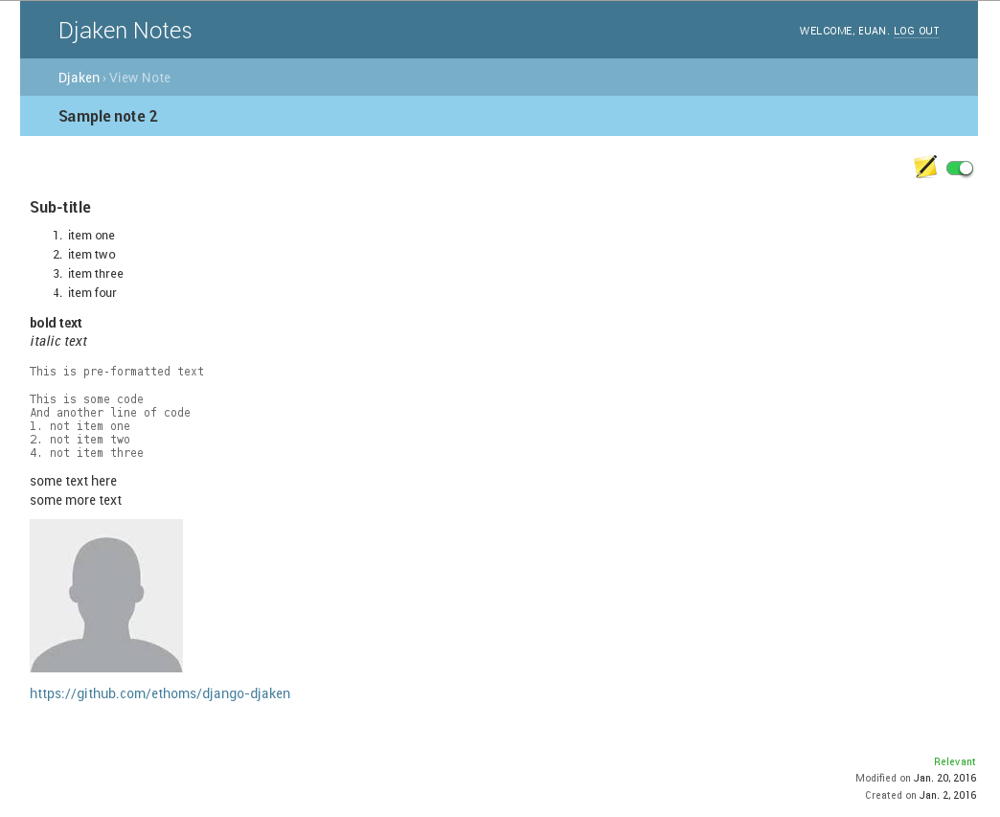
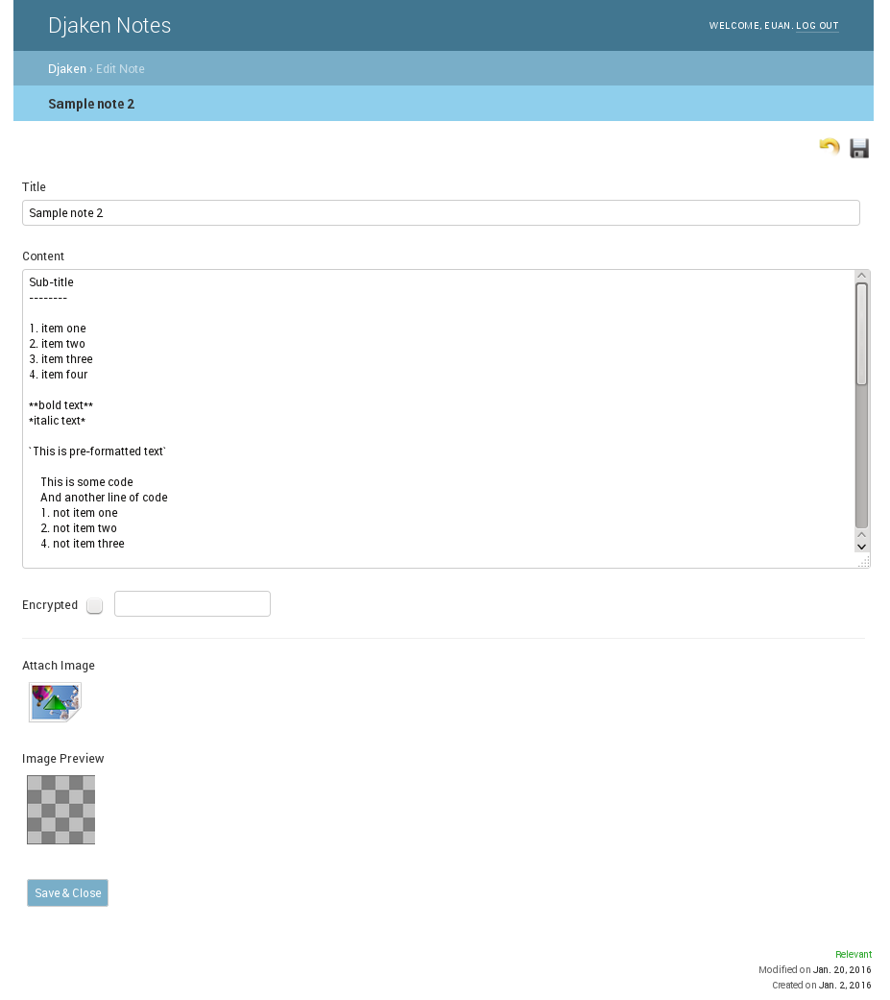
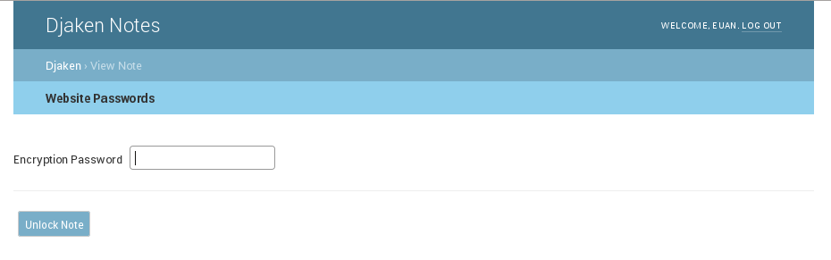

Djaken Notes
============

Djaken is a complete web-based notes application for Django.

News
~~~~

Version 1.0.1 released (05/04/2018)
-----------------------------------

**Changes in 1.0.1**

* FIXED: added missing initial migrations

Version 1.0 released! (30th March 2018)
---------------------------------------

This release signifies the maturity of the 1.x versions.  
It also marks the end of the 1.x series and so it becomes a matured 
legacy version. Maintenance releases may be made available if needed. 

The next version will start the 2.x series with some quite big changes. 
The changes will likely make migration difficult and the new feature set 
may not please all users. So this 1.0 version allows existing users to stay 
using what they are used to and what they chose as a notes application. 
And without any migration to worry about.  
More news to follow about these new changes.

**Changes in 1.0**

* FIXED: encrypted notes; unlock_note url without form data ('get' instead
  of 'post') should redirect to view_note instead of generating a 
  django error.
* POLICY CHANGE: The options DJAKEN_MARKDOWN_AUTO_ADD_LINE_BREAKS and 
  DJAKEN_MARKDOWN_AUTO_ADD_LINK_TAGS are now set to False 
  by default. This is due to the required text analysis can 
  cause performance issues with large inline attached images.
  To keep the same behaviour, the option(s) will need to be 
  set to True in the projects settings.py

Version 1.0rc3 released with the following changes:
---------------------------------------------------

* FIXED: **CRITICAL BUG**; changing relevancy on encrypted notes causes note to be
  unable to unlock.
* FIXED: unwanted space under info / warning / error notifications.
* FIXED: more space needed above h1 elements (markdown title).
* FIXED: turn off client-side caching for notes pages (view_note and edit_note).
* FIXED: auto http link tagging should not apply to code blocks.

Features
~~~~~~~~

* Intuitive, simple and stream-lined user interface.
* Login/logout of the notes application.
* Create and edit notes in Markdown.
* Attach images within a note.
* Notes can be marked 'Not relevant' and are kept out of view by default.
* Encrypted notes (stored in database using an AES symmetric cipher).
* Keyword search of note title and content.
* Sort by modified/created date.
* Automatically add Markdown tags to HTTP URLs (optional).
* Automatically add Markdown line-breaks for new lines (optional).

Options / Settings
~~~~~~~~~~~~~~~~~~

* DJAKEN_MARKDOWN_AUTO_ADD_LINE_BREAKS (bool:default=False)
* DJAKEN_MARKDOWN_AUTO_ADD_LINK_TAGS (bool:default=False)
* DJAKEN_BRANDING_TITLE (str:default='Djaken Notes')

Requirements
~~~~~~~~~~~~

* Django>=1.7
* Markdown>=2.0
* pycrypto>=2.6

Quick start
~~~~~~~~~~~

1. Add "djaken" to your INSTALLED_APPS setting like this::

    INSTALLED_APPS = [
        ...
        'djaken',
    ]

2. Include the djaken URLconf in your project urls.py like this::

    url(r'^djaken/', include('djaken.urls')),

3. Run `python manage.py migrate` to create the djaken models.

4. Start the development server and visit http://127.0.0.1:8000/djaken/
   to start adding notes.

Screen-shots
~~~~~~~~~~~~

All Notes (homepage)  

.. image:: screenshots/djaken-all_notes-1.png

View Note  

Edit Note  

Unlock an encrypted note  

