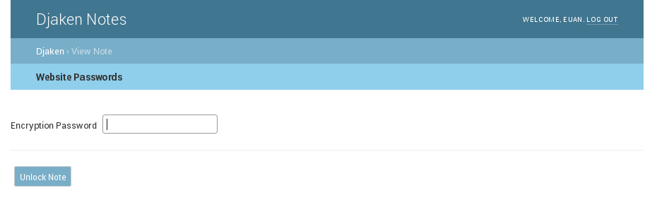

Djaken Notes
============

Djaken is a complete web-based notes application for Django.

News
~~~~

Version 2.0a1 released! (3rd April 2018)
---------------------------------------

**Changes in 2.0**

Features
~~~~~~~~

* Intuitive, simple and stream-lined user interface.
* Login/logout of the notes application.
* Create and edit notes in reStructuredText.
* Attach inline images (within a note).
* Notes can be marked 'Not relevant' and are kept out of view by default.
* Encrypted notes (stored in database using an AES symmetric cipher).
* Keyword search of note title and content.
* Sort by modified/created date.

Options / Settings
~~~~~~~~~~~~~~~~~~

* DJAKEN_BRANDING_TITLE (str:default='Djaken Notes')

Requirements
~~~~~~~~~~~~

* Django>=1.9
* docutils>=0.12
* pycrypto>=2.6

Quick start
~~~~~~~~~~~

1. Add "djaken" to your INSTALLED_APPS setting like this::

    INSTALLED_APPS = [
        ...
        'djaken',
    ]

2. Include the djaken URLconf in your project urls.py like this::

    url(r'^djaken/', include('djaken.urls')),

3. Run `python manage.py migrate` to create the djaken models.

4. Start the development server and visit http://127.0.0.1:8000/djaken/
   to start adding notes.

Screen-shots
~~~~~~~~~~~~

All Notes (homepage)  

.. image:: screenshots/djaken-all_notes-1.png

View Note  

Edit Note  

.. image:: screenshots/djaken-edit_note-1.png

Unlock an encrypted note  

